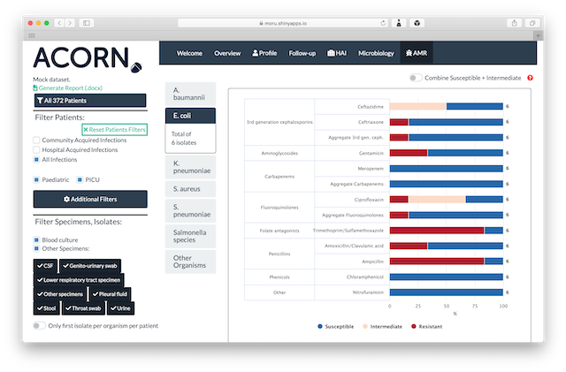

# ACORN Roadmap

## Phase 1

The first phase of the ACORN project has been completed!
As a result, one can access [ACORN online app](https://moru.shinyapps.io/acornamr/) to visualise a demo dataset or previously generated ACORN Data. To generate ACORN Data, use the offline version, available on [the GitHub repository of the project](https://github.com/ocelhay/ACORN).

## Phase 2

The second phase of the project is scheduled to start by the beginning of 2021.