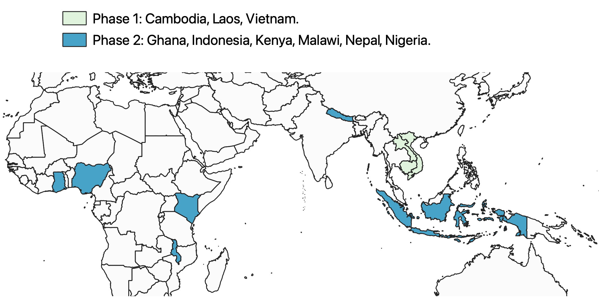

# A Clinically Oriented antimicrobial Resistance Network (ACORN)

ACORN is a Wellcome funded human health clinical AMR surveillance project led by the [Mahidol-Oxford Tropical Medicine Research Unit](https://www.tropmedres.ac/) (MORU) and the [Oxford University of Oxford Clinical Research Unit](http://www.oucru.org/) (OUCRU).

## Why is ACORN needed? 

Existing AMR surveillance systems are based mostly on diagnostic microbiology laboratory antimicrobial susceptibility testing results alone, which limits interpretability of resistant proportions. Resulting data fail to give relevant feedback for treatment decisions for local clinicians and do not allow for direct assessment and subsequent modelling of the clinically relevant impacts and burden of drug resistant infections (DRI). Tools to capture and analyse AMR data in low- and middle-income countries (LMIC) are scarce, which hinders engagement with and use of available data.

To fill these gaps, the major aim of ACORN is to develop and test a comprehensive data capture system for patient-focussed AMR surveillance in LMIC settings. Surveillance will include diagnostic stewardship activities. Data collected will harmonise with and expand on the pathogen-focussed <a href="https://www.who.int/glass/en/" target="_blank">WHO Global Antimicrobial Resistance Surveillance System</a> to enable accurate classification of infection syndromes and patient outcomes. These data will be of critical importance to estimate syndromic and/or pathogen outcomes and associated costs: i.e. how many people die from DRIs and how much does AMR cost?

## Where is ACORN surveillance being done? 

A pilot project was done at Angkor Hospital for Children (Siem Reap, Cambodia), Mahosot Hospital (Vientiane, Lao PDR), and the National Hospital for Tropical Diseases (Hanoi, Vietnam). In the second phase, surveillance is being rolled out at 15 hospitals across 9 Asian and African countries.

## Further Reading

- ACORN concept: https://academic.oup.com/jacamr/article/2/1/dlaa018/5804106
- ACORN phase 1 protocol: https://wellcomeopenresearch.org/articles/5-13
- Costs of AMR surveillance: https://journals.plos.org/globalpublichealth/article?id=10.1371/journal.pgph.0000018