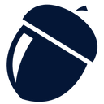

# ACORN <small>v2</small>

> Development, implementation and assessment of enhanced antimicrobial resistance (AMR) surveillance.

- Follow WHO GLASS Recommendations
- Integrate Patient Data Collection
- Provide Dashboard for Visualisation & Analysis

[GitHub](https://github.com/acornamr)
[Get Started](./README.md)