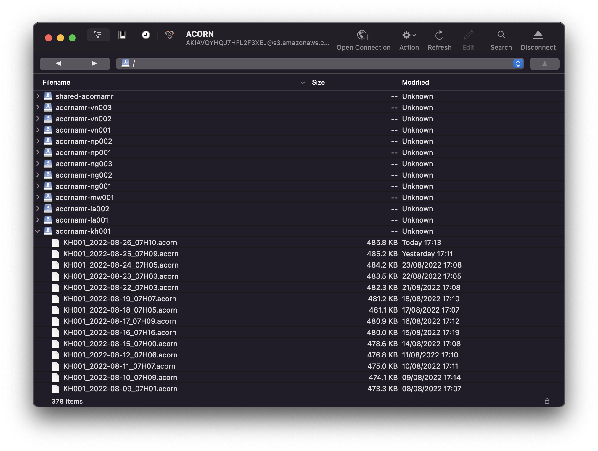

# Data Management

Raw clinical data and lab data are managed in ACORN with REDCap and with each site lab data management software. 
The dashboard is used when all clinical and lab data has been collected. It is the tool to combine these data into an .acorn file and to save this file on servers. *(an .acorn file contains data frames that can be read with R.)*
We use Amazon Web Services (AWS) to manage the ACORN data and to create backups on a secure platform.


# Overview of Data on AWS

For ACORN, we manage several independent buckets containing all the data elements required to operate the dashboard and securely save the data created (`.acorn` files).



The buckets are of four types:

- site buckets `acornamr-cyXXX` (one for each site). Each site bucket contains :
    - several `.acorn` files with data specific to the site.
    - two data dictionaries files for laboratory data in WHONET and tabular formats.
- one demo bucket `acornamr-demo` containing `.acorn` files that can be showcase for demonstration purposes.
- one bucket for data used across sites `shared-acornamr`. It contains:
    - a file with ACORN project lab codes.
    - encrypted files with credentials to access each site bucket.
- one backup bucket `acornamr-backup`. *Using the AWS DataSync service, we have created daily backup tasks: at 10am UTC, a backup of all new objects in every site buckets is completed in this backup bucket located in “US East (N. Virginia) us-east-1” region.*


# Add a New Site

Adding a site require to carefully follow several steps to update elements in AWS and in the dashboard.

The following elements should be gathered before starting to add a new site:

- CSV file `ACORN2_site_codes.csv`
- MS Excel file `ACORN2_Cred.xlsx`
- Credentials for access to AWS console as a root user.
- REDCap API keys for F01-F05 forms and HAI.
- R script for `create_encrypted_credentials.R`


## Update ACORN Site Codes

- Update the file `ACORN2_site_codes.csv` with the site information on TEAMS. Share this updated file with the dashboard developer.
- [Dashboard developer] updates the file in the `www/data/` folder.


## Create a Site Bucket

Sign in to the AWS Console at [https://aws.amazon.com](https://aws.amazon.com) as ACORN root user.
In the "Storage" section of the dropdown menu "Services", select S3.

In **Amazon S3**, create a bucket named `acornamr-cyXXX` with :

- `cy` the [two-letters ISO country code ](https://en.wikipedia.org/wiki/ISO_3166-1_alpha-2#Officially_assigned_code_elements)
- `XXX` the number of the site, starting at `001` and adding a unit with every new site added to the project.

Use the following settings (that can be reviewed in the Properties tab):

- AWS region set to `EU (Paris) eu-west-3`.
- Block all public access.
- Bucket Versioning Enabled.
- Server-side encryption with Amazon S3 key (SSE-S3).

## Create a Policy

In the "Security, Identity, & Compliance" section of the dropdown menu "Services", select IAM.

In **Identity and Access Management (IAM) >> Access Management >> Policies**, create a policy, using JSON, name it “cyXXX-LRW-policy”:

```
{
    "Version": "2012-10-17",
    "Statement": [
        {
            "Sid": "statement1",
            "Effect": "Allow",
            "Action": [
                "s3:GetBucketLocation",
                "s3:ListBucket"
            ],
            "Resource": [
                "arn:aws:s3:::acornamr-cyXXX"
            ]
        },
        {
            "Sid": "statement2",
            "Effect": "Allow",
            "Action": [
                "s3:GetObject"
            ],
            "Resource": [
                "arn:aws:s3:::acornamr-cyXXX/*"
            ]
        },
        {
            "Sid": "statement3",
            "Effect": "Allow",
            "Action": [
                "s3:PutObject"
            ],
            "Resource": [
                "arn:aws:s3:::acornamr-cyXXX/*"
            ]
        }
    ]
}
```

## Create a User

In **Identity and Access Management (IAM) >> Access Management >> Users**, click on "Add users" and proceed with:

- User name: “admin-cyXXX”.
- Access type: Programmatic access.
- Attach existing policies directly, search for “cyXXX-LRW-policy”.
- Copy the access key and secret key in a safe place - it will be added to the `ACORN2_Cred.xlsx` file. 

## Create a Backup Task

### Create a IAM role for access

(TODO describe steps resulting in the creation of the new role: AWSDataSyncS3BucketAccess-acornamr-cyXXX.)

### Create Task


In the "Migration & Transfer" section of the dropdown menu "Services", select DataSync.

In **AWS DataSync**, click on "Create task" and set proceed with:

- Create a new location.
- Location type: Amazon S3; Region: Europe (Paris).
- Select the bucket "acornamr-cyXXX".
- S3 storage class : Standard.
- Folder "" (blank).
- IAM role: AWSDataSyncS3BucketAccess-acornamr-cyXXX.
- Click on "Next".
- Select "Create a new location".
- Location type: Amazon S3.
- S3 bucket: acornamr-backup.
- S3 storage class: Standard.
- Folder: "cyXXX"
- IAM role: AWSDataSyncS3BucketAccess-acornamr-backup
- Click on "Next".
- Task name: "backup-cyXXX"
- (Accept all default settings.)
- Schedule: Frequency: daily
- Schedule: at 10:00
- Create task.


## Create Credentials with R

- Ask for credentials emails from the site.
- Download latest KeePass file on TEAMS.
- Add credential emails with generated passwords and other elements to `ACORN2_cred.xlsx` in the KeePass file.
    - AWS access and secret keys obtained when creating the user (see above).
    - REDCap API keys should be identical to the other sites.
    - Check that there is no autocompletion of elements (name of buckets etc.) in Excel.
- Update the KeePass file on TEAMS.
- [Dashboard developer] generates the `.rds` credential files with R using the script https://github.com/acornamr/acorn-dashboard/blob/master/misc/create_encrypted_credentials.R
- [Dashboard developer] upload the `.rds` credentials files to the `shared-acornamr` bucket.
- Test that these new credentials are working properly.
- Email new credentials.


# Access AWS via FTP

Several FTP clients are available to access AWS, we recommend [Cyberduck](https://en.wikipedia.org/wiki/Cyberduck) that is multi-platform and free.

To access AWS buckets, you will need to:

1. connect to the AWS console using acorn project credential
2. create a KEY and SECRET pair in the console
3. use this KEY and SECRET pair to set up a connection in your FTP client


The following actions should be performed with a FTP client:

- update the lab codes by replacing `ACORN2_lab_codes.xlsx` in /shared-acornamr bucket
- add/remove a user by adding/removing `encrypted_cred_xxYYYY_zzz.rd` in /shared-acornamr bucket
- update a site data dictionary by replacing `ACORN2_lab_data_dictionary_xxYYY_TABULAR.xlsx` and/or `ACORN2_lab_data_dictionary_xxYYY_WHONET.xlsx` in the site bucket.
- download `.acorn` or `.acorn_non_anonymised` files from a site bucket.