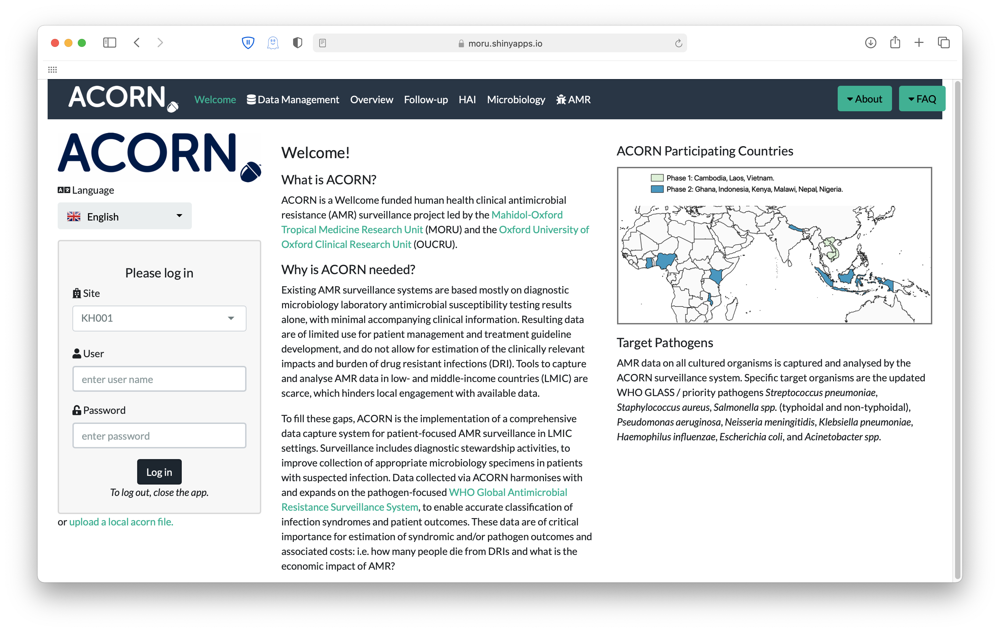

# ACORN Roadmap

## Phase 1

The first / pilot phase of the ACORN project has been completed!
As a result, you can access the proof of concept [ACORN online app](https://moru.shinyapps.io/acornamr/) to visualise a demo dataset or previously generated ACORN Data. To generate ACORN Data, the offline version of the app was used, available on [the GitHub repository of the project](https://github.com/ocelhay/ACORN).

## Phase 2

The second phase of the project started in September 2021. This phase includes expanded  inclusion criteria and refined data capture and analysis tools. You can access the ACORN dashboard [online](https://moru.shinyapps.io/acorn2/) or use the [standalone app](https://acornamr.net/#/dashboard-access).

